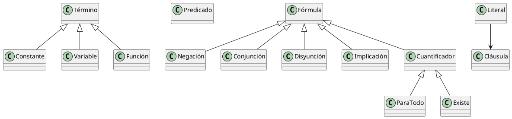

# Proyecto de Inferencia Lógica

## Ejemplos de Uso

### Ejemplo 1: Caso Pompeya
Base de conocimiento:

```shell-session
"marco es humano"
"marco es pompeyano"
"todo pompeyano es humano"
"cesar es gobernante"
"todos pompeyano son o leal a cesar o odia a cesar"
"todo humano asesina a gobernante a que no es leal"
"marco asesina a cesar"
```

Consulta de ejemplo:
- "¿Marco odia a César?"
```python
realizar_consulta_detallada(
    motor,
    "¿Marco odia a César?",
    Predicado("Odia", [Variable("marco"), Variable("cesar")])
)
```
Esta consulta requiere inferir si, dado que Marco es pompeyano y asesina a César, se puede deducir que lo odia.

### Ejemplo 2: Relaciones Familiares
Base de conocimiento:

```shell-session
"juan es padre de maria"
"maria es madre de pedro"
"todo padre es abuelo de los hijos de sus hijos"
```

Consulta de ejemplo:
- "¿Juan es abuelo de Pedro?"
```python
realizar_consulta_detallada(
    motor,
    "¿Es Juan abuelo de Pedro?",
    Predicado("Abuelo", [Variable("juan"), Variable("pedro")])
)
```
Esta consulta requiere inferir una relación de abuelo a través de la regla transitiva sobre relaciones padre/madre.

## Funcionamiento del Sistema

### Proceso General de Inferencia

El sistema sigue una serie de pasos estructurados para procesar el conocimiento y realizar inferencias:

1. **Entrada de Datos**
   - Recibe un conjunto de frases en lenguaje natural que conformarán la base de conocimiento
   - Acepta una consulta que puede estar en:
     * Lenguaje natural
     * Formato de cláusula lógica predefinida

2. **Transformación a Lógica de Primer Orden**
   - Analiza cada frase del lenguaje natural
   - Identifica predicados, variables y relaciones
   - Convierte las frases a fórmulas de lógica de primer orden

3. **Proceso de Clausificación**
   - Descompone fórmulas complejas en cláusulas más simples
   - Elimina implicaciones y cuantificadores
   - Normaliza las expresiones a forma clausal

4. **Gestión de la Base de Conocimiento**
   - Almacena las cláusulas resultantes
   - Mantiene un conjunto coherente de hechos y reglas

5. **Procesamiento de la Consulta**
   - Convierte la consulta a forma lógica (si está en lenguaje natural)
   - Prepara la consulta para el proceso de refutación

6. **Negación de la Consulta**
   - Niega la fórmula de la consulta
   - Prepara la negación para el proceso de clausificación

7. **Clausificación de la Consulta**
   - Aplica el proceso de clausificación a la consulta negada
   - Genera las cláusulas necesarias para la refutación

8. **Inferencia por Refutación**
   - Combina la base de conocimiento con la consulta negada
   - Aplica el algoritmo de resolución
   - Busca derivar la cláusula vacía para probar la validez

## Estructuras de Lógica de Primer Orden

El sistema implementa la lógica de primer orden mediante una jerarquía de clases que representan los diferentes elementos lógicos:

### Elementos Básicos

#### Término
- **Definición**: Clase base que representa los elementos más básicos de la lógica.
- **Implementación**: Clase abstracta con métodos para identificar el tipo de término.
- **Ejemplo**: 
```python
class Termino:
    def __init__(self, nombre):
        self.nombre = nombre
```

#### Constante
- **Definición**: Representa un objeto específico en el dominio del discurso.
- **Implementación**: Hereda de Término, representa valores fijos.
- **Ejemplo**: `Constante("marco")` → representa el individuo "marco"

#### Variable
- **Definición**: Representa un elemento no específico que puede tomar diferentes valores.
- **Implementación**: Hereda de Término, usado en cuantificadores y unificación.
- **Ejemplo**: `Variable("x")` → representa una variable que puede ser cualquier individuo

#### Función
- **Definición**: Mapea términos a otros términos.
- **Implementación**: Hereda de Término, contiene una lista de argumentos.
- **Ejemplo**: 
```python
Funcion("padre", [Constante("juan"), Constante("maria")])
```

#### Predicado
- **Definición**: Representa relaciones o propiedades sobre términos.
- **Implementación**: Contiene un nombre y una lista de argumentos.
- **Ejemplo**: `Predicado("Humano", [Constante("marco")])` → representa "marco es humano"

### Fórmulas Lógicas

#### Fórmula
- **Definición**: Clase base para todas las expresiones lógicas.
- **Implementación**: Clase abstracta de la que heredan todas las construcciones lógicas.

#### Negación
- **Definición**: Representa la negación lógica de una fórmula.
- **Implementación**: Contiene una fórmula como operando.
- **Ejemplo**: `Negacion(Predicado("Humano", [Variable("x")]))` → representa "no es humano(x)"

#### Conjunción
- **Definición**: Representa el "y" lógico entre dos fórmulas.
- **Implementación**: Contiene dos fórmulas (izquierda y derecha).
- **Ejemplo**: 
```python
Conjuncion(
    Predicado("Humano", [Variable("x")]),
    Predicado("Mortal", [Variable("x")])
)
```

#### Disyunción
- **Definición**: Representa el "o" lógico entre dos fórmulas.
- **Implementación**: Contiene dos fórmulas (izquierda y derecha).
- **Ejemplo**: 
```python
Disyuncion(
    Predicado("Leal", [Variable("x"), Constante("cesar")]),
    Predicado("Odia", [Variable("x"), Constante("cesar")])
)
```

#### Implicación
- **Definición**: Representa la implicación lógica (si-entonces).
- **Implementación**: Contiene antecedente y consecuente.
- **Ejemplo**: 
```python
Implicacion(
    Predicado("Humano", [Variable("x")]),
    Predicado("Mortal", [Variable("x")])
)
```

### Cuantificadores

#### Cuantificador
- **Definición**: Clase base para los cuantificadores.
- **Implementación**: Contiene una variable y una fórmula.

#### ParaTodo
- **Definición**: Representa el cuantificador universal (∀).
- **Implementación**: Hereda de Cuantificador.
- **Ejemplo**: 
```python
ParaTodo(
    Variable("x"),
    Implicacion(
        Predicado("Humano", [Variable("x")]),
        Predicado("Mortal", [Variable("x")])
    )
)
```

#### Existe
- **Definición**: Representa el cuantificador existencial (∃).
- **Implementación**: Hereda de Cuantificador.
- **Ejemplo**: 
```python
Existe(
    Variable("x"),
    Predicado("Humano", [Variable("x")])
)
```

### Elementos de Resolución

#### Literal
- **Definición**: Representa un predicado o su negación.
- **Implementación**: Contiene un predicado y un flag de negación.
- **Ejemplo**: 
```python
Literal(Predicado("Humano", [Constante("marco")]), negado=False)
```

#### Cláusula
- **Definición**: Conjunto de literales en disyunción.
- **Implementación**: Contiene una lista de literales.
- **Ejemplo**: 
```python
Clausula([
    Literal(Predicado("Humano", [Variable("x")]), negado=False),
    Literal(Predicado("Mortal", [Variable("x")]), negado=True)
])
```

### Combinación de Elementos

Las estructuras anteriores se combinan para formar expresiones complejas de lógica de primer orden:

1. Los términos (constantes, variables, funciones) son los bloques básicos.
2. Los predicados utilizan términos como argumentos.
3. Las fórmulas combinan predicados usando operadores lógicos.
4. Los cuantificadores vinculan variables en fórmulas.
5. Los literales y cláusulas se usan en el proceso de resolución.

**Ejemplo Completo**:
```python
# "Todo humano es mortal"
ParaTodo(
    Variable("x"),
    Implicacion(
        Predicado("Humano", [Variable("x")]),
        Predicado("Mortal", [Variable("x")])
    )
)
```

# Jerarquía de Elementos Lógicos


