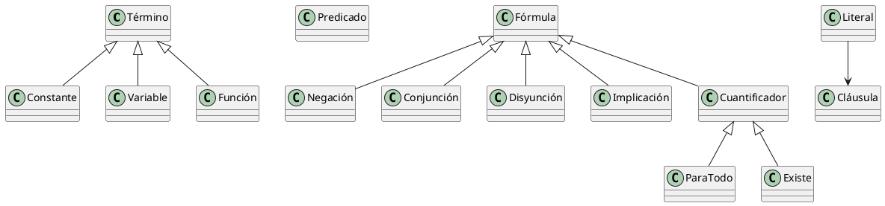

# Proyecto de Inferencia Lógica

## Ejemplos de Uso

### Ejemplo 1: Caso Pompeya
Base de conocimiento:

```shell-session
"marco es humano"
"marco es pompeyano"
"todo pompeyano es humano"
"cesar es gobernante"
"todos pompeyano son o leal a cesar o odia a cesar"
"todo humano asesina a gobernante a que no es leal"
"marco asesina a cesar"
```

Consulta de ejemplo:
- "¿Marco odia a César?"
```python
realizar_consulta_detallada(
    motor,
    "¿Marco odia a César?",
    Predicado("Odia", [Variable("marco"), Variable("cesar")])
)
```
Esta consulta requiere inferir si, dado que Marco es pompeyano y asesina a César, se puede deducir que lo odia.

### Ejemplo 2: Relaciones Familiares
Base de conocimiento:

```shell-session
"juan es padre de maria"
"maria es madre de pedro"
"todo padre es abuelo de los hijos de sus hijos"
```

Consulta de ejemplo:
- "¿Juan es abuelo de Pedro?"
```python
realizar_consulta_detallada(
    motor,
    "¿Es Juan abuelo de Pedro?",
    Predicado("Abuelo", [Variable("juan"), Variable("pedro")])
)
```
Esta consulta requiere inferir una relación de abuelo a través de la regla transitiva sobre relaciones padre/madre.

## Funcionamiento del Sistema

### Proceso General de Inferencia

El sistema sigue una serie de pasos estructurados para procesar el conocimiento y realizar inferencias:

1. **Entrada de Datos**
   - Recibe un conjunto de frases en lenguaje natural que conformarán la base de conocimiento
   - Acepta una consulta que puede estar en:
     * Lenguaje natural
     * Formato de cláusula lógica predefinida

2. **Transformación a Lógica de Primer Orden**
   - Analiza cada frase del lenguaje natural
   - Identifica predicados, variables y relaciones
   - Convierte las frases a fórmulas de lógica de primer orden

3. **Proceso de Clausificación**
   - Descompone fórmulas complejas en cláusulas más simples
   - Elimina implicaciones y cuantificadores
   - Normaliza las expresiones a forma clausal

4. **Gestión de la Base de Conocimiento**
   - Almacena las cláusulas resultantes
   - Mantiene un conjunto coherente de hechos y reglas

5. **Procesamiento de la Consulta**
   - Convierte la consulta a forma lógica (si está en lenguaje natural)
   - Prepara la consulta para el proceso de refutación

6. **Negación de la Consulta**
   - Niega la fórmula de la consulta
   - Prepara la negación para el proceso de clausificación

7. **Clausificación de la Consulta**
   - Aplica el proceso de clausificación a la consulta negada
   - Genera las cláusulas necesarias para la refutación

8. **Inferencia por Refutación**
   - Combina la base de conocimiento con la consulta negada
   - Aplica el algoritmo de resolución
   - Busca derivar la cláusula vacía para probar la validez

## Estructuras de Lógica de Primer Orden

El sistema implementa la lógica de primer orden mediante una jerarquía de clases que representan los diferentes elementos lógicos:

### Elementos Básicos

#### Término
- **Definición**: Clase base que representa los elementos más básicos de la lógica.
- **Implementación**: Clase abstracta con métodos para identificar el tipo de término.
- **Ejemplo**: 
```python
class Termino:
    def __init__(self, nombre):
        self.nombre = nombre
```

#### Constante
- **Definición**: Representa un objeto específico en el dominio del discurso.
- **Implementación**: Hereda de Término, representa valores fijos.
- **Ejemplo**: `Constante("marco")` → representa el individuo "marco"

#### Variable
- **Definición**: Representa un elemento no específico que puede tomar diferentes valores.
- **Implementación**: Hereda de Término, usado en cuantificadores y unificación.
- **Ejemplo**: `Variable("x")` → representa una variable que puede ser cualquier individuo

#### Función
- **Definición**: Mapea términos a otros términos.
- **Implementación**: Hereda de Término, contiene una lista de argumentos.
- **Ejemplo**: 
```python
Funcion("padre", [Constante("juan"), Constante("maria")])
```

#### Predicado
- **Definición**: Representa relaciones o propiedades sobre términos.
- **Implementación**: Contiene un nombre y una lista de argumentos.
- **Ejemplo**: `Predicado("Humano", [Constante("marco")])` → representa "marco es humano"

### Fórmulas Lógicas

#### Fórmula
- **Definición**: Clase base para todas las expresiones lógicas.
- **Implementación**: Clase abstracta de la que heredan todas las construcciones lógicas.

#### Negación
- **Definición**: Representa la negación lógica de una fórmula.
- **Implementación**: Contiene una fórmula como operando.
- **Ejemplo**: `Negacion(Predicado("Humano", [Variable("x")]))` → representa "no es humano(x)"

#### Conjunción
- **Definición**: Representa el "y" lógico entre dos fórmulas.
- **Implementación**: Contiene dos fórmulas (izquierda y derecha).
- **Ejemplo**: 
```python
Conjuncion(
    Predicado("Humano", [Variable("x")]),
    Predicado("Mortal", [Variable("x")])
)
```

#### Disyunción
- **Definición**: Representa el "o" lógico entre dos fórmulas.
- **Implementación**: Contiene dos fórmulas (izquierda y derecha).
- **Ejemplo**: 
```python
Disyuncion(
    Predicado("Leal", [Variable("x"), Constante("cesar")]),
    Predicado("Odia", [Variable("x"), Constante("cesar")])
)
```

#### Implicación
- **Definición**: Representa la implicación lógica (si-entonces).
- **Implementación**: Contiene antecedente y consecuente.
- **Ejemplo**: 
```python
Implicacion(
    Predicado("Humano", [Variable("x")]),
    Predicado("Mortal", [Variable("x")])
)
```

### Cuantificadores

#### Cuantificador
- **Definición**: Clase base para los cuantificadores.
- **Implementación**: Contiene una variable y una fórmula.

#### ParaTodo
- **Definición**: Representa el cuantificador universal (∀).
- **Implementación**: Hereda de Cuantificador.
- **Ejemplo**: 
```python
ParaTodo(
    Variable("x"),
    Implicacion(
        Predicado("Humano", [Variable("x")]),
        Predicado("Mortal", [Variable("x")])
    )
)
```

#### Existe
- **Definición**: Representa el cuantificador existencial (∃).
- **Implementación**: Hereda de Cuantificador.
- **Ejemplo**: 
```python
Existe(
    Variable("x"),
    Predicado("Humano", [Variable("x")])
)
```

### Elementos de Resolución

#### Literal
- **Definición**: Representa un predicado o su negación.
- **Implementación**: Contiene un predicado y un flag de negación.
- **Ejemplo**: 
```python
Literal(Predicado("Humano", [Constante("marco")]), negado=False)
```

#### Cláusula
- **Definición**: Conjunto de literales en disyunción.
- **Implementación**: Contiene una lista de literales.
- **Ejemplo**: 
```python
Clausula([
    Literal(Predicado("Humano", [Variable("x")]), negado=False),
    Literal(Predicado("Mortal", [Variable("x")]), negado=True)
])
```

### Combinación de Elementos

Las estructuras anteriores se combinan para formar expresiones complejas de lógica de primer orden:

1. Los términos (constantes, variables, funciones) son los bloques básicos.
2. Los predicados utilizan términos como argumentos.
3. Las fórmulas combinan predicados usando operadores lógicos.
4. Los cuantificadores vinculan variables en fórmulas.
5. Los literales y cláusulas se usan en el proceso de resolución.

**Ejemplo Completo**:
```python
# "Todo humano es mortal"
ParaTodo(
    Variable("x"),
    Implicacion(
        Predicado("Humano", [Variable("x")]),
        Predicado("Mortal", [Variable("x")])
    )
)
```

# Jerarquía de Elementos Lógicos



Puedes visualizar este diagrama en [PlantText](https://www.planttext.com/)

## Parser Lógico

### Estructura y Funcionamiento

El parser lógico está diseñado para transformar dos tipos de entrada:
1. Fórmulas en notación lógica formal
2. Frases en lenguaje natural restringido

#### Parser de Fórmulas Formales

Procesa expresiones lógicas con la siguiente sintaxis:
- Predicados: `Predicado(arg1, arg2, ...)`
- Negación: `¬` o `~`
- Conectivos: `∧` (and), `∨` (or), `→` (implica)
- Cuantificadores: `∀` (para todo), `∃` (existe)

Ejemplo:
```python
# Salida: "∀x.(Humano(x) → Mortal(x))"
ParaTodo(
    Variable("x"),
    Implicacion(
        Predicado("Humano", [Variable("x")]),
        Predicado("Mortal", [Variable("x")])
    )
)
```

#### Parser de Lenguaje Natural

Maneja varios patrones de frases:

1. **Relaciones Binarias**:
```python
# "Juan es padre de María"
Predicado("Padre", [Constante("Juan"), Constante("Maria")])
```

2. **Reglas Universales**:
```python
# "Todo humano es mortal"
ParaTodo(
    Variable("x"),
    Implicacion(
        Predicado("Humano", [Variable("x")]),
        Predicado("Mortal", [Variable("x")])
    )
)
```

3. **Disyunciones**:
```python
# "Todos pompeyano son o leal a cesar o odia a cesar"
ParaTodo(
    Variable("x"),
    Implicacion(
        Predicado("Pompeyano", [Variable("x")]),
        Disyuncion(
            Predicado("Leal", [Variable("x"), Constante("Cesar")]),
            Predicado("Odia", [Variable("x"), Constante("Cesar")])
        )
    )
)
```

### Proceso de Parsing

1. **Tokenización**: Divide la entrada en componentes significativos
```python
# Ejemplo: "juan es padre de maria"
frase = frase.lower().strip()
if " es " in frase and " de " in frase:
    antes_es = frase.split(" es ")[0].strip()      # "juan"
    entre_es_y_de = frase.split(" es ")[1].split(" de ")[0].strip()  # "padre"
    despues_de = frase.split(" de ")[1].strip()    # "maria"
```

2. **Identificación de Patrones**: Detecta estructuras sintácticas conocidas
```python
# Identifica diferentes patrones en el texto
if " es " in frase and " de " in frase:
    # Patrón de relación binaria: "X es Y de Z"
    tipo = "relacion_binaria"
elif "todo" in frase and " es " in frase:
    # Patrón de regla universal: "todo X es Y"
    tipo = "regla_universal"
elif "asesina a" in frase:
    # Patrón de acción: "X asesina a Y"
    tipo = "predicado_accion"
```

3. **Construcción del AST**: Genera el predicado
```python
# Para una relación binaria: "juan es padre de maria"
def construir_ast_relacion_binaria(antes_es, relacion, despues_de):
    return Predicado(
        relacion.capitalize(),  # Nodo raíz: predicado "Padre"
        [
            Constante(antes_es.capitalize()),    # Hijo izquierdo: "Juan"
            Constante(despues_de.capitalize())   # Hijo derecho: "Maria"
        ]
    )

```

### Ejemplo Completo de Transformación

```python
# Entrada: "todo humano asesina a gobernante que no es leal"
def procesar_regla_compleja(frase):
    # 1. Tokenización
    partes = frase.split("asesina a")
    sujeto = partes[0].replace("todo", "").strip()
    objeto = partes[1].split("que")[0].strip()
    
    # 2. Identificación del patrón
    # Detecta patrón de regla condicional con negación
    
    # 3. Construcción del AST
    x = Variable("x")
    y = Variable("y")
    
    # 4. Transformación a fórmula lógica
    return ParaTodo(x, ParaTodo(y, 
        Implicacion(
            Conjuncion(
                Predicado(sujeto.capitalize(), [x]),
                Conjuncion(
                    Predicado(objeto.capitalize(), [y]),
                    Negacion(Predicado("Leal", [x, y]))
                )
            ),
            Predicado("Asesina", [x, y])
        )
    ))

# Resultado:
# ∀x.∀y.(Humano(x) ∧ (Gobernante(y) ∧ ¬Leal(x,y)) → Asesina(x,y))
```

¿Te gustaría que expanda algún ejemplo específico o que muestre más casos de transformación?

### Patrones Principales de Lenguaje Natural

- `"X es Y"` → Predicados unarios
- `"X es Y de Z"` → Relaciones binarias
- `"todo X es Y"` → Cuantificación universal
- `"X verbo a Y"` → Predicados de acción
- `"todos X son o Y o Z"` → Disyunciones universales

## Proceso de Clausificación

### Objetivo y Utilidad
La clausificación es un proceso fundamental que transforma fórmulas de lógica de primer orden en un conjunto de cláusulas en forma normal conjuntiva (FNC). Este proceso es esencial porque:
- Estandariza todas las fórmulas en un formato uniforme
- Facilita el proceso de resolución
- Permite aplicar el algoritmo de unificación
- Hace posible la refutación automática

### Pasos del Proceso de Clausificación

1. **Eliminación de Implicaciones**
   - Transforma A → B en ¬A ∨ B
```python
def eliminar_implicaciones(formula):
    if isinstance(formula, Implicacion):
        return Disyuncion(
            Negacion(eliminar_implicaciones(formula.antecedente)),
            eliminar_implicaciones(formula.consecuente)
        )
```

2. **Movimiento de Negaciones**
   - Aplica las leyes de De Morgan
   - Mueve las negaciones hacia los predicados
```python
def mover_negaciones(formula):
    if isinstance(formula, Negacion):
        sub = formula.operando
        if isinstance(sub, Conjuncion):  # ¬(A ∧ B) = ¬A ∨ ¬B
            return Disyuncion(
                mover_negaciones(Negacion(sub.izquierda)), 
                mover_negaciones(Negacion(sub.derecha))
            )
        elif isinstance(sub, ParaTodo):  # ¬∀x P = ∃x ¬P
            return Existe(sub.variable, mover_negaciones(Negacion(sub.formula)))
```

3. **Estandarización de Variables**
   - Renombra variables para evitar conflictos
```python
def estandarizar_variables(formula, mapping=None, contador=None):
    if isinstance(formula, ParaTodo):
        var_original = formula.variable.nombre
        nuevo_nombre = f"{var_original}_{contador[0]}"
        contador[0] += 1
        mapping[var_original] = nuevo_nombre
        nueva_var = Variable(nuevo_nombre)
```

4. **Skolemización**
   - Elimina cuantificadores existenciales
   - Introduce funciones de Skolem
```python
def skolemizar(formula, vars_universales=None, contador=None):
    if isinstance(formula, Existe):
        if vars_universales:
            nombre_funcion = f"f{contador[0]}"
            argumentos = [Variable(v) for v in vars_universales]
            skolem_term = Funcion(nombre_funcion, argumentos)
        else:
            skolem_term = Constante(f"c{contador[0]}")
```

5. **Eliminación de Cuantificadores Universales**
```python
def eliminar_cuantificadores_universales(formula):
    if isinstance(formula, ParaTodo):
        return eliminar_cuantificadores_universales(formula.formula)
```

6. **Distribución de Disyunciones sobre Conjunciones**
```python
def distribuir_or(formula):
    if isinstance(formula, Disyuncion):
        if isinstance(formula.izquierda, Conjuncion):
            return Conjuncion(
                distribuir_or(Disyuncion(formula.izquierda.izquierda, formula.derecha)),
                distribuir_or(Disyuncion(formula.izquierda.derecha, formula.derecha))
            )
```

### Agregación a la Base de Conocimiento

La base de conocimiento mantiene las cláusulas y gestiona su agregación:

```python
class BaseConocimiento:
    def __init__(self):
        self.clausulas = set()

    def agregar_formula(self, formula):
        print(f"\nAgregando fórmula: {formula}")
        nuevas_clausulas = convertir_a_clausulas(formula)
        for literales in nuevas_clausulas:
            clausula = Clausula([
                Literal(lit[1], lit[0] == "¬") 
                for lit in literales
            ])
            self.clausulas.add(clausula)
```

## Inferencia por Refutación

### 1. Negación de la Consulta
El proceso de refutación comienza negando la consulta original. Esto se realiza mediante:
- Aplicación del operador de negación a la fórmula de consulta
- Conversión de la fórmula negada a forma clausal
- Adición de las cláusulas resultantes al conjunto de trabajo

#### 1.1 Proceso de Negación
```python
def negar_consulta(self, consulta):
    """Niega la consulta y la convierte a forma clausal"""
    negacion = Negacion(consulta)
    return convertir_a_clausulas(negacion)
```

#### 1.2 Preparación para Refutación
```python
def probar_por_refutacion(self, consulta, max_iteraciones=1000):
    # Obtener cláusulas de la consulta negada
    clausulas_negadas = self.negar_consulta(consulta)
    clausulas_trabajo = self.base_conocimiento.clausulas.copy()
    
    # Agregar cláusulas negadas al conjunto de trabajo
    for literales in clausulas_negadas:
        clausula = Clausula([
            Literal(lit[1], lit[0] == "¬") 
            for lit in literales
        ])
        clausulas_trabajo.add(clausula)
        print(f"Agregada negación: {clausula}")
```

### 2. Proceso de Resolución

#### 2.1 Unificación
El algoritmo de unificación es fundamental para el proceso de resolución:
- Busca sustituciones que hagan iguales dos términos
- Maneja variables, constantes y funciones
- Verifica la ocurrencia de variables para evitar ciclos
- Aplica las sustituciones de manera recursiva

#### 2.2 Resolución de Cláusulas
La resolución opera sobre pares de cláusulas:
- Identifica literales complementarios (uno negado y otro no)
- Intenta unificar los predicados de estos literales
- Genera nuevas cláusulas (resolventes) eliminando los literales unificados
- Aplica las sustituciones encontradas a los literales restantes

#### 2.3 Estrategia de Búsqueda
El proceso de búsqueda de la refutación:
- Mantiene un conjunto de trabajo con las cláusulas disponibles
- Aplica resolución a todos los pares posibles de cláusulas
- Agrega las resolventes nuevas al conjunto de trabajo
- Continúa hasta encontrar la cláusula vacía o agotar las posibilidades

### 3. Criterios de Terminación

El proceso termina cuando:
1. **Éxito**: Se deriva la cláusula vacía
2. **Fallo**: No se pueden generar nuevas cláusulas
3. **Indeterminado**: Se alcanza el límite de iteraciones (1000)


